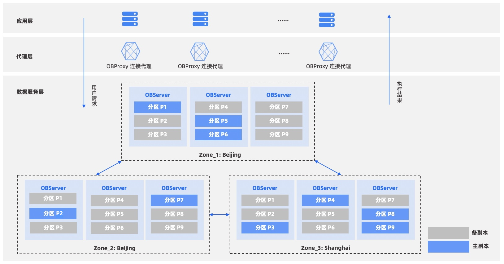

# OceanBase 数据库架构

OceanBase采用了无共享(Shared-Nothing)的集群架构，集群由若干完全对等的计算机（称为节点）组成，每个节点都有其私有的物理资源（包括CPU、内存、硬盘等），并且在这些节点上运行着独立的存储引擎、SQL引擎、事务引擎等。集群中各个节点之间相互独立，但通过连接彼此的网络设备相互协调，共同作为一个整体完成用户的各种请求。由于节点之间的独立性，使得 OceanBase 具备可扩展、高可用、高性能、低成本等核心特性。

## 可用区(Zone)

OceanBase 数据库的一个集群由若干个节点组成。这些节点分属于若干个可用区（Zone），每个节点属于一个可用区。可用区是一个逻辑概念，OceanBase使用zone来实现数据的高可用性和灾备特性。可用区可以在不同的机房、区域等，进而实现不同场景的容灾。OceanBase 使用强一致性协议 Paxos 实现高可用，同一个Paxos组下的数据，位于不同的可用区。

## 分区(Partition)

在 OceanBase 数据库中，一个表的数据可以按照某种划分规则水平拆分为多个分片，每个分片叫做一个表分区，简称分区（Partition）。分区支持包括hash、range、list等类型，还支持二级分区。例如，交易库中的订单表，可以先按照用户 ID 划分为若干一级分区，再按照月份把每个一级分区划分为若干二级分区。对于二级分区表，第二级的每个子分区是一个物理分区，而第一级分区只是逻辑概念。一个表的若干个分区可以分布在一个可用区内的多个节点上。每个物理分区有一个用于存储数据的存储层对象，叫做 Tablet，用于存储有序的数据记录。

## 日志流(Log Stream)

当用户对 Tablet 中记录进行修改的时候，为了保证数据持久化，需要记录重做日志（REDO）到 Tablet 对应的日志流（Log Stream）里。一个日志流对应其所在节点上的多个 Tablet。Tablet 使用多副本机制来保证高可用。一般来说，副本分散在不同的可用区里。多个副本中有且只有一个副本接受修改操作，叫做主副本（Leader），其它的叫做从副本（Follower）。主从副本之间通过基于 Multi-Paxos 的分布式共识协议实现了副本之间数据的一致性。而 Multi-Paxos 使用 Log Stream 来实现数据复制。Tablet 可以在Log Stream之间迁移，以实现资源的负载均衡。

## OBServer

在集群的每个节点上会运行一个叫做 observer 的服务进程。每个服务负责自己所在节点上分区数据的存取，也负责路由到本机的 SQL 语句的解析和执行。这些服务进程之间通过 TCP/IP 协议进行通信。同时，每个服务会监听来自外部应用的连接请求，建立连接和数据库会话，并提供数据库服务。

## 多租户

为了简化大规模部署多个业务数据库的管理并降低资源成本，OceanBase 数据库提供了独特的多租户特性。在一个 OceanBase 集群内，可以创建多个相互隔离的数据库"实例"，叫做一个租户。从应用程序的视角来看，每个租户等同于一个独立的数据库实例。每个租户可以选择 MySQL 或 Oracle 兼容模式。应用连接到 MySQL 租户后，可以在租户下创建用户、database，与一个独立的 MySQL 库的使用体验是一样的。一个新的集群初始化之后，会存在一个特殊的名为 sys 的租户，叫做系统租户。系统租户中保存了集群的元数据，是一个 MySQL 兼容模式的租户。

除了系统租户和用户租户，OceanBase 还有一个称为Meta的租户。每创建一个用户租户系统就会自动创建一个对应的 Meta 租户，其生命周期与用户租户保持一致。Meta 租户用于存储和管理用户租户的集群私有数据，这部分数据不需要进行跨库物理同步以及物理备份恢复，这些数据包括：配置项、位置信息、副本信息、日志流状态、备份恢复相关信息、合并信息等。

## 资源单元

为了隔离租户的资源，每个 observer 进程内可以有多个属于不同租户的虚拟容器，叫做资源单元（resource unit），资源单元包括 CPU 、内存和磁盘资源。多个资源单元组成一个资源池(resource pool)，使用资源池可以指定使用哪个资源单元、多少个资源单元以及资源分布的可用区。创建租户时，指定所使用的资源池列表，这样控制租户使用的资源和数据分布位置。

## obproxy

应用程序通常并不直接与 OBServer 建立连接，而是连接obproxy，然后由 obproxy 转发 SQL 请求到合适的 OBServer 节点。obproxy 会缓存数据分区相关的信息，可以将SQL请求路由到尽量合适的 OBServer 节点。obproxy 是无状态的服务，多个 obproxy 节点可以通过网络负载均衡（SLB）对应用提供统一的网络地址。
